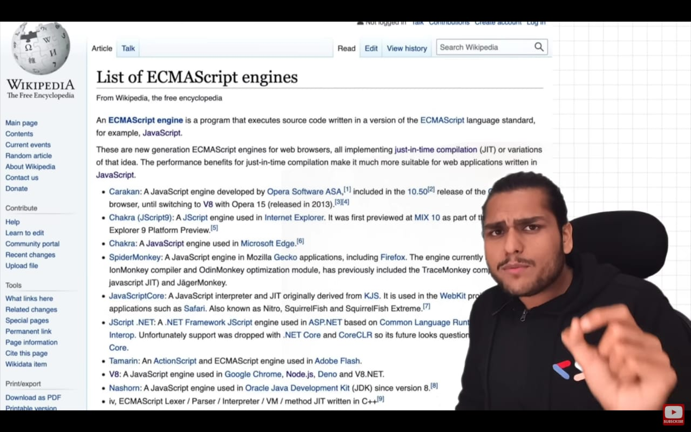
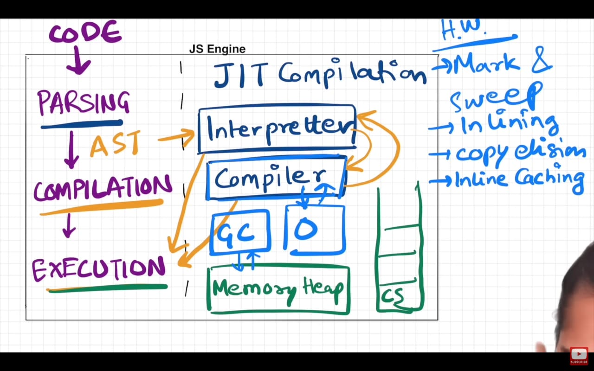

JavaScript Engine

JavaScript RunTime Environment?

JIT compilation (Just in Time Iterpretation)
 uses both 

 Interpretter and Compiler to run the code

            most browers today use this to make code run faster and efficient

execution is not possible without 

        Memory Heap
        Call Stack

memory heap stores all the variables and functions

also Garbage collector that sweeps all the garbage 
                Mark and Sweep algorithm

other things inside the engine are the compiler's compilation tricks 

        inlining
        copy elision
        inline caching
        etc

