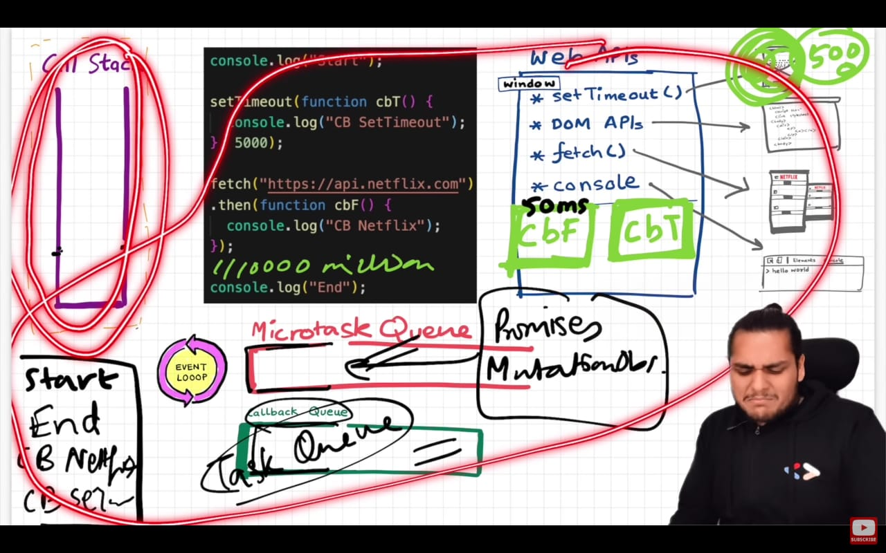
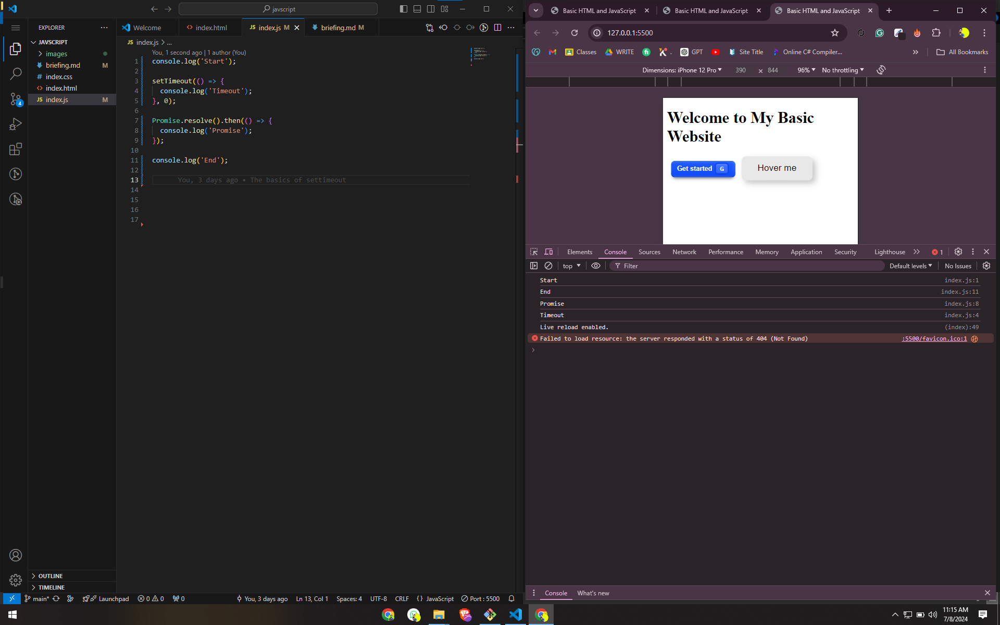

Fetch in JavaScript

It has higher priority than SetTimeout()

it is places in Microstack Queue

And the priority is set by Event loop

Microtask queue has higher priority it contains Promises and Mutationhandler

This is just the concept learnt in Operating System again and again there is more to these queues and stacks which here uptil now its basic 

the code is written in index.js

and the output was as following on the right side under console

